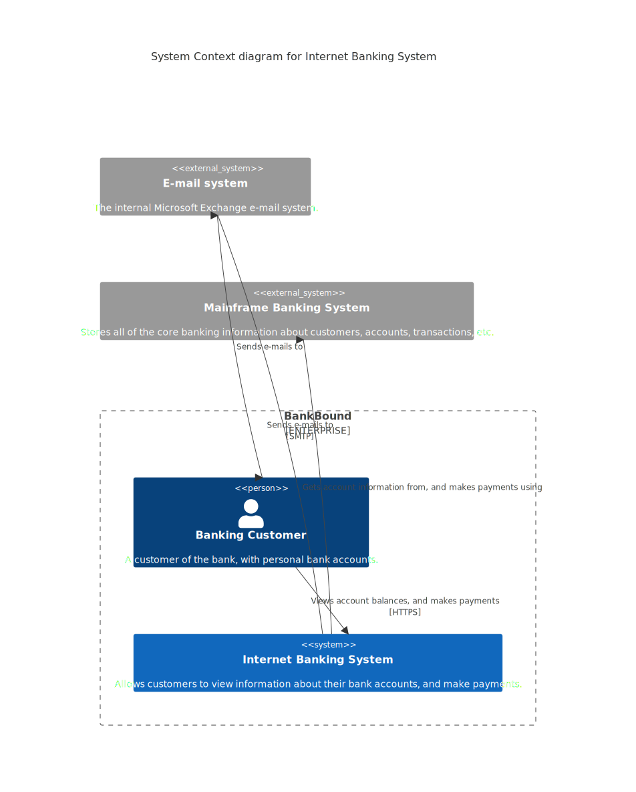

# Mermaid CSS Styling

This run tests Mermaid styling via custom CSS to get a more polished aesthetic.

## Inputs

- `docs/runs/mermaid-css/custom_mermaid.css` (dark)
- `docs/runs/mermaid-css/custom_mermaid_light.css` (light)

## Outputs

- Dark: `docs/runs/mermaid-css/stylized_mermaid.svg`
- Dark (PNG): `docs/runs/mermaid-css/stylized_mermaid.png`
- Light: `docs/runs/mermaid-css/light_mermaid.svg`
- Light (PNG): `docs/runs/mermaid-css/light_mermaid.png`

## Visuals

### Dark Theme


### Light Theme


## Rendering (example)

```bash
# Dark theme
mmdc -i input.mmd -o stylized_mermaid.svg --cssFile custom_mermaid.css

# Light theme
mmdc -i input.mmd -o light_mermaid.svg --cssFile custom_mermaid_light.css
```

## Notes

- The CSS is embedded in the output SVGs for portability.
- Mermaid theming is powerful but requires a browser-based renderer (mmdc/Puppeteer).
