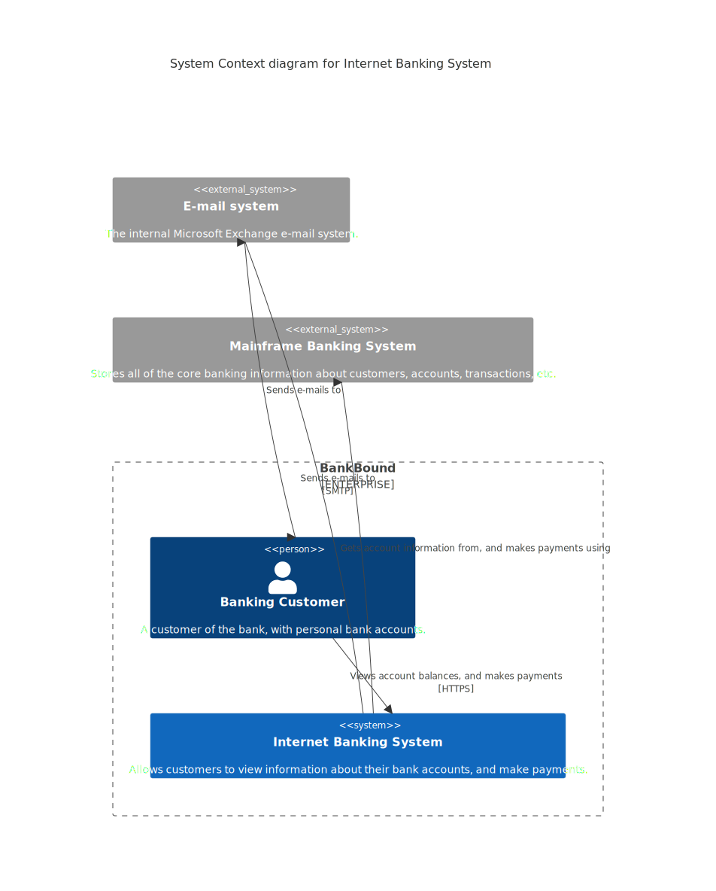

# Banking C4 (D2 vs Mermaid)

This run compares a simple C4-style banking diagram rendered with D2 and Mermaid.

## Inputs

- `runs/banking-c4/banking.d2`
- `runs/banking-c4/banking.mmd`

## Outputs

- D2: `runs/banking-c4/banking_d2.svg`
- Mermaid: `runs/banking-c4/banking_mermaid.svg`

## Visuals

### D2


### Mermaid



## Rendering (example)

```bash
# D2
# Uses ELK layout engine configured in the .d2 file
# (see vars.d2-config in the source)
d2 banking.d2 banking_d2.svg

# Mermaid
mmdc -i banking.mmd -o banking_mermaid.svg
```

## Notes

- D2 uses a nested structure that is easier for LLMs to generate reliably.
- Mermaid is portable but less precise with layout for more complex diagrams.
