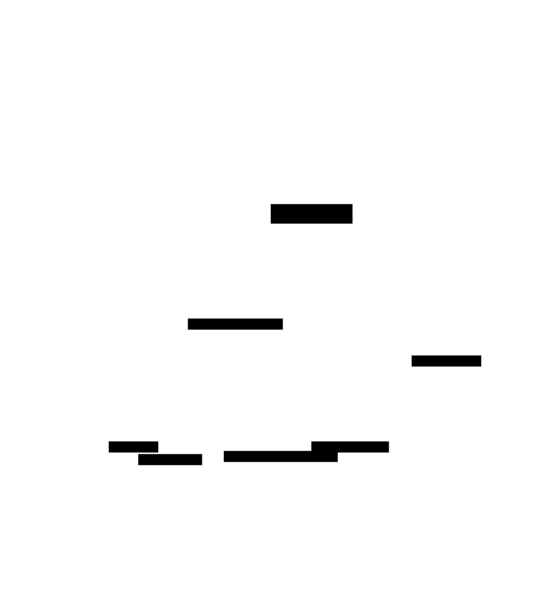
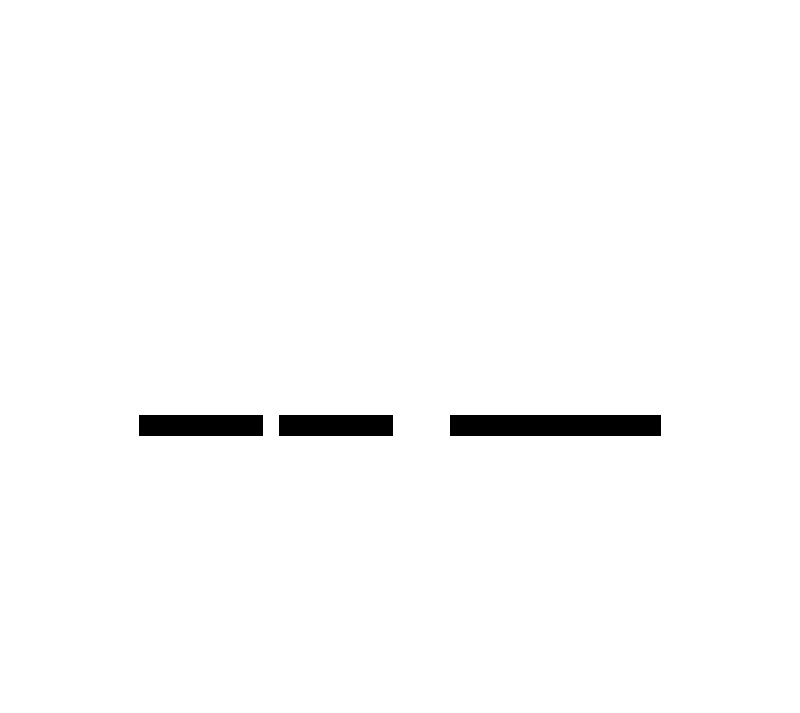

# D2 examples (quick overview)

This directory contains a **small set of D2 examples** meant to give a fast, visual overview.

- Each example shows the **rendered SVG** next to its **`.d2` source**, so you can copy/modify quickly.
- For a much larger and more detailed gallery, see: https://d2lang.com/examples/overview/

---

## Examples

### ACP selector architecture

<table style="width: 100%; table-layout: fixed;">
  <colgroup>
    <col style="width: 50%" />
    <col style="width: 50%" />
  </colgroup>
  <thead>
    <tr>
      <th align="left">Diagram (SVG)</th>
      <th align="left">Source (<code>.d2</code>)</th>
    </tr>
  </thead>
  <tbody>
    <tr>
      <td>
        
      </td>
      <td>

```d2
direction: down
title: ACP Controller Selector & Backend Abstraction {near: top-center}

Controller {
    user: User {
        shape: person
    }
    ui: "UI /acp-controller"
}

Backend {
    facade: "Genie.ACP"
    registry: "Config Registry"
    supervisor: "ConnectionSupervisor"
    pubsub: PubSub

}
Controller.user -> Controller.ui: "1. Selects Backend\n2. Clicks Connect"
Controller.ui -> Backend.facade: start_connection(id)
Backend.pubsub -> Controller.ui: "Stream Updates"

Backend.facade -> Backend.registry: Lookup(id)
Backend.registry -> Backend.facade: "{Module, Opts}"
Backend.facade -> Backend.supervisor: "start_child(Module, Opts)"
Backend.facade -> Backend.pubsub: "Broadcast Events"
```

</td>
    </tr>
  </tbody>
</table>

---

### Pi RPC protocol

<table style="width: 100%; table-layout: fixed;">
  <colgroup>
    <col style="width: 50%" />
    <col style="width: 50%" />
  </colgroup>
  <thead>
    <tr>
      <th align="left">Diagram (SVG)</th>
      <th align="left">Source (<code>.d2</code>)</th>
    </tr>
  </thead>
  <tbody>
    <tr>
      <td>
        
      </td>
      <td>

```d2
title: Pi RPC Protocol Flow | {near: top-center}

Message Generation {
  Pi -> Client: "message_start"
  loop Streaming {
    Pi -> Client: "message_update (deltas)"
  }
  Pi -> Client: "message_end"
}
```

</td>
    </tr>
  </tbody>
</table>
