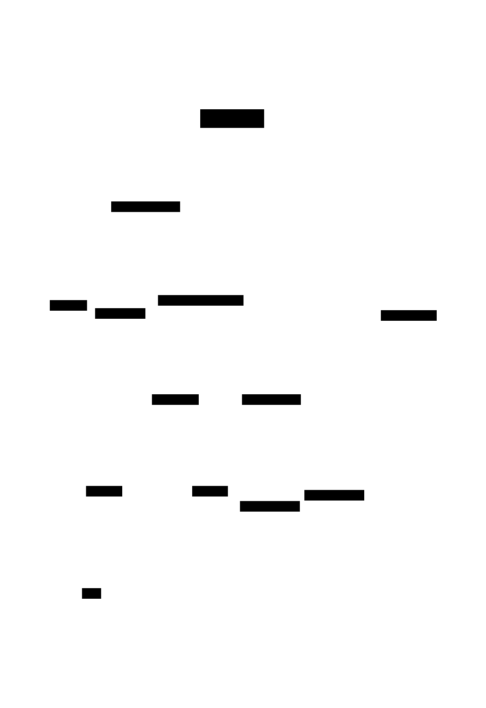
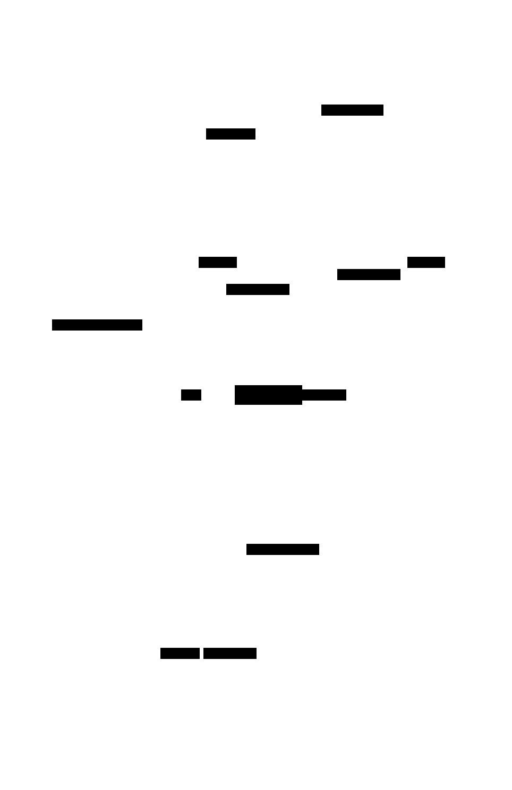
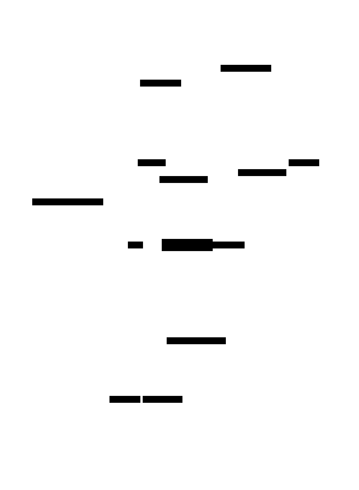

# D2 layout variants (TL;DR)

Same `.d2` source, multiple SVGs rendered with different **layout engines** and flags, so you can quickly compare what’s most readable.

See [D2 Layout Engine Documentation](https://d2lang.com/tour/layouts/) for more details.

**Gist (why you’d care)**

- Switching **layout engine** often reduces edge crossings and improves spacing/alignment without touching the `.d2`.
- `-s` makes diagrams feel more “human”/approachable (nice for docs/slides).
- `-t <id>` lets you match a visual style guide consistently.

**Layout engines used here:**

- `dagre` (default): A fast, directed graph layout engine that produces layered/hierarchical layouts. Based on Graphviz's DOT algorithm.
  - For me this looks more appealing and less "technical" than the ELK layout.
  - Legacy / Unmaintained but as long as it works with D2 it's my personal default for non-technical diagrams and communication documents.
- `elk`: Also a directed graph layout engine. More mature than dagre, better maintained (part-time academic research team working on it), with recent releases.
  - This layout is awesomely good at producing clean, orthogonal layouts. It's also the layout engine used by the [C4 model](https://c4model.com/).

---

## Input

Source diagram (`acp_selector_architecture.d2`):

```d2
user: User
ui: "UI /acp-controller"
facade: "Genie.ACP"
registry: "Config Registry"
supervisor: "ConnectionSupervisor"
backend_acp: "Backends.ACP"
backend_proc: "Backends.Process"
acpex_lib: "ACPex Library"
agent_proc: "OpenCode Agent"
os_proc: "OS Process"
pubsub: PubSub

user -> ui: "1. Selects Backend\n2. Clicks Connect"
ui -> facade: start_connection(id)
facade -> registry: Lookup(id)
registry -> facade: "{Module, Opts}"
facade -> supervisor: "start_child(Module, Opts)"

supervisor -> backend_acp: "Starts (if ACP)"
supervisor -> backend_proc: "Starts (if Process)"

backend_acp -> acpex_lib: JSON-RPC
acpex_lib -> agent_proc: Stdio

backend_proc -> os_proc: "Port/Stdio"

backend_acp -> pubsub: "Broadcast Events"
backend_proc -> pubsub: "Broadcast Events"

pubsub -> ui: "Stream Updates"
```

## Visuals (comparison table)

<!-- Markdown tables don't reliably stretch to full width; HTML does. -->

<table style="width: 100%; table-layout: fixed;">
  <colgroup>
    <col style="width: 22%" />
    <col style="width: 39%" />
    <col style="width: 39%" />
  </colgroup>
  <thead>
    <tr>
      <th align="left">Style</th>
      <th align="left">Dagre (<code>-l dagre</code>)</th>
      <th align="left">ELK (<code>-l elk</code>)</th>
    </tr>
  </thead>
  <tbody>
    <tr>
      <td>Default</td>
      <td></td>
      <td></td>
    </tr>
    <tr>
      <td>Sketch (<code>-s</code>)</td>
      <td></td>
      <td></td>
    </tr>
    <tr>
      <td>Sketch + theme 105 (<code>-s -t 105</code>)</td>
      <td></td>
      <td></td>
    </tr>
  </tbody>
</table>
